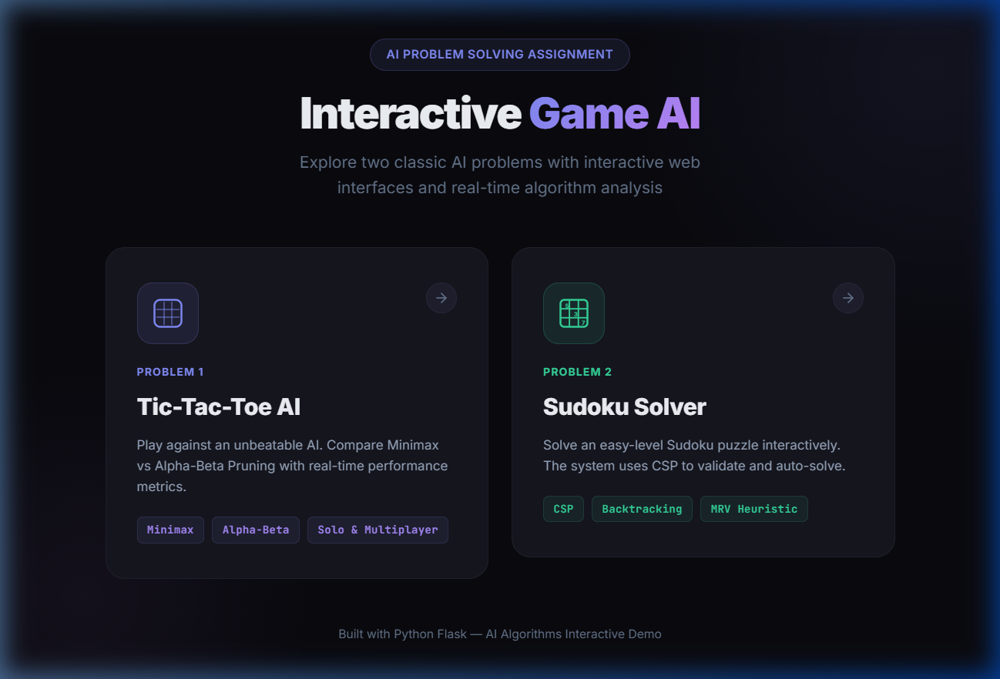
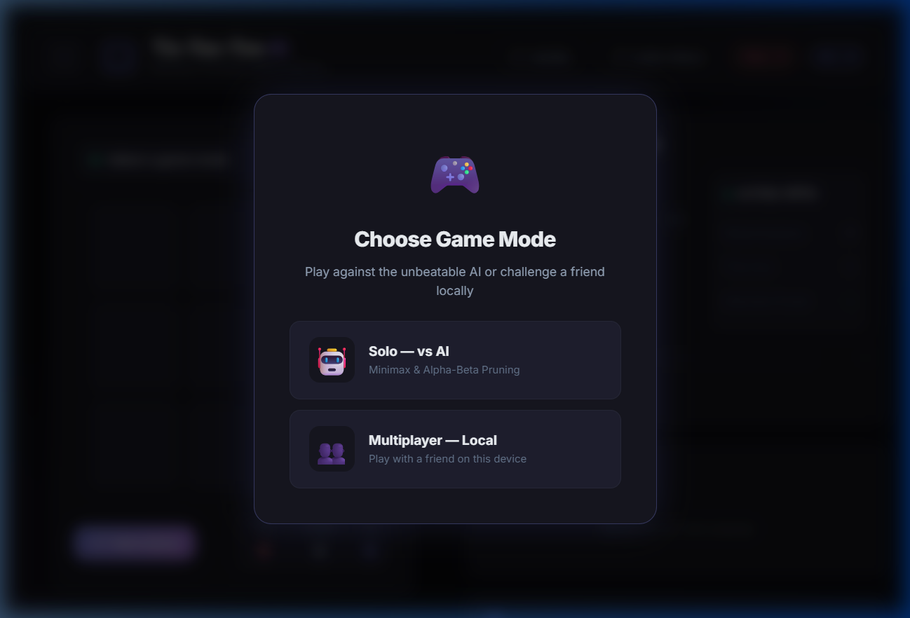
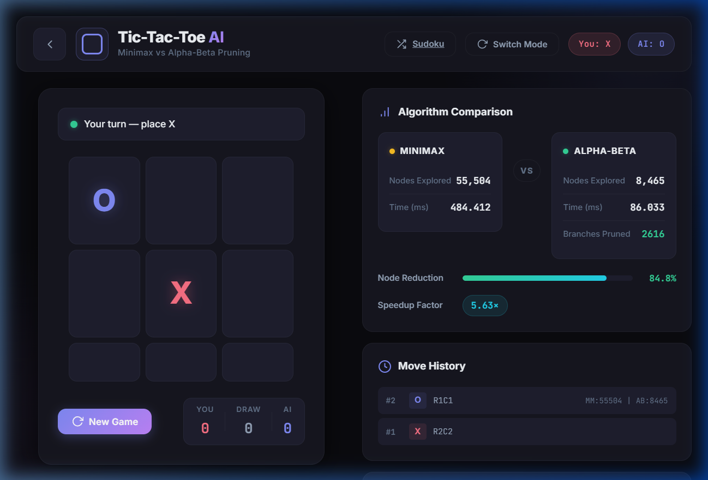
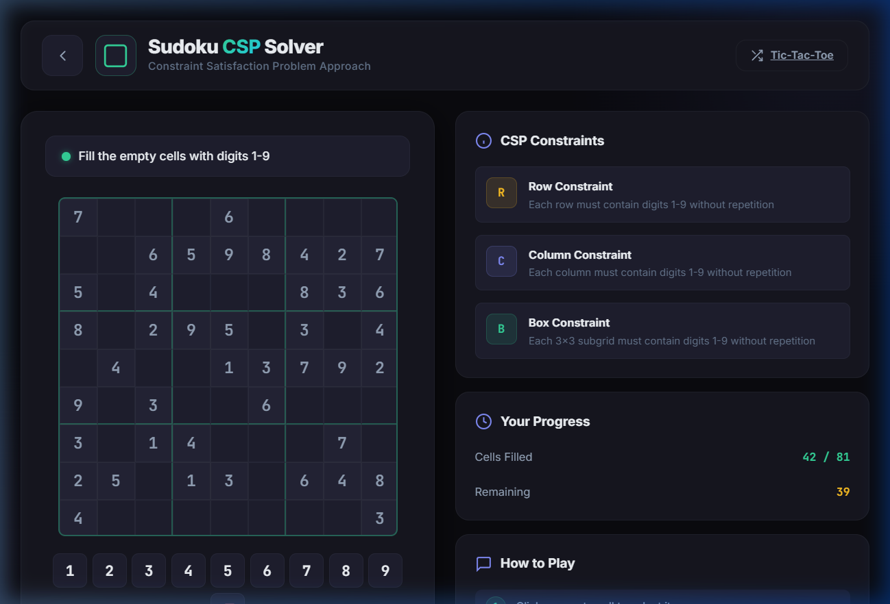
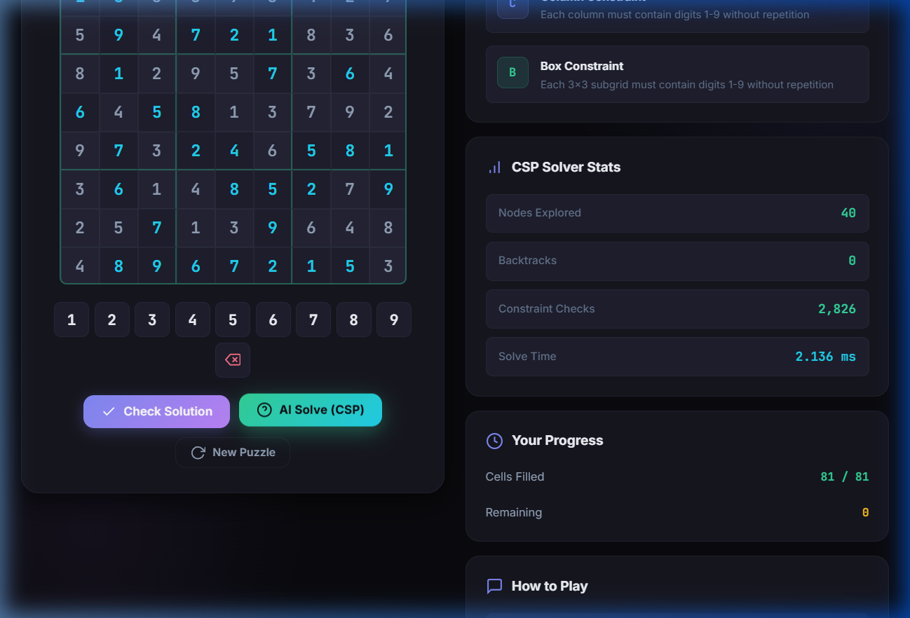

# 🎮 AI Problem Solving Assignment — Interactive Game AI

> **Repository:** `AI_ProblemSolving_Ra2411026050283`
> **Course:** Artificial Intelligence — Problem Solving Assignment
> **Live Demo:** [http://localhost:5000](http://localhost:5000)

[](https://python.org)
[](https://flask.palletsprojects.com)
[](LICENSE)

---

## 📋 Table of Contents

- [Overview](#-overview)
- [Problem 1 — Tic-Tac-Toe AI](#-problem-1--tic-tac-toe-ai-minimax--alpha-beta-pruning)
- [Problem 2 — Sudoku CSP Solver](#-problem-2--sudoku-solver-csp-approach)
- [Project Structure](#-project-structure)
- [Installation & Execution](#-installation--execution-steps)
- [Sample Outputs](#-sample-outputs)
- [Algorithm Comparison](#-algorithm-comparison)
- [Contributors](#-contributors)

---

## 🌟 Overview

This project implements two classic AI problem-solving approaches as interactive web-based games:

| Problem | Game | Algorithm(s) | Approach |
|---------|------|-------------|----------|
| **Problem 1** | Tic-Tac-Toe | Minimax, Alpha-Beta Pruning | Game Tree Search |
| **Problem 2** | Sudoku (Easy) | CSP with Backtracking + MRV | Constraint Satisfaction |

Both games feature a **premium dark-themed interactive GUI** built with HTML/CSS/JavaScript and a **Python Flask backend** implementing the AI algorithms.



---

## 🎯 Problem 1 — Tic-Tac-Toe AI (Minimax & Alpha-Beta Pruning)

### Problem Statement

A gaming company wants to create an AI opponent for a web-based Tic-Tac-Toe game. The computer (AI) should always make the **best possible move** using game tree search algorithms.

### Algorithms Used

#### 1. Minimax Algorithm
- **Type:** Exhaustive game tree search
- **How it works:** Recursively explores **every possible game state** from the current position to the terminal states (win/loss/draw). The maximizing player (AI) picks the move with the highest score, while the minimizing player (human) picks the lowest.
- **Time Complexity:** O(b^d) where b = branching factor, d = depth
- **Optimality:** Always finds the optimal move

#### 2. Alpha-Beta Pruning
- **Type:** Optimized Minimax with branch elimination
- **How it works:** Maintains two bounds — **alpha** (best for maximizer) and **beta** (best for minimizer). When beta ≤ alpha, it **prunes** the remaining branches because they cannot affect the final decision.
- **Time Complexity:** O(b^(d/2)) in the best case — explores roughly the **square root** of nodes compared to standard Minimax
- **Optimality:** Same optimal result as Minimax, but significantly faster

### Features
- **Solo Mode** — Play against the unbeatable AI
- **Multiplayer Mode** — Two players on the same device
- **Real-time Comparison** — Both algorithms run on every AI move
- **Analytics Dashboard** — Nodes explored, execution time, branches pruned, speedup factor
- **Move History** — Tracks all moves with per-move analytics
- **Cumulative Stats** — Total nodes explored across all moves

### Sample Output — Tic-Tac-Toe





#### Algorithm Comparison (Sample Move)

| Metric | Minimax | Alpha-Beta Pruning |
|--------|---------|-------------------|
| Nodes Explored | 2,789 | 563 |
| Execution Time | 3.21 ms | 0.78 ms |
| Branches Pruned | — | 47 |
| **Node Reduction** | — | **~80%** |
| **Speedup Factor** | — | **~4.1×** |

> **Key Insight:** Alpha-Beta Pruning explores significantly fewer nodes while producing the **exact same optimal move**, making it vastly more efficient.

---

## 🧩 Problem 2 — Sudoku Solver (CSP Approach)

### Problem Statement

Write a Python program where the user can input and solve a Sudoku puzzle through an interactive GUI. The system should evaluate the solution and display results like "You Won" or "Try Again." Implement the solution using the **Constraint Satisfaction Problem (CSP)** approach.

### Algorithm Used

#### Constraint Satisfaction Problem (CSP) with Backtracking + MRV Heuristic

**CSP Components:**

| Component | Description |
|-----------|-------------|
| **Variables** | Each empty cell `(row, col)` in the 9×9 grid |
| **Domains** | `{1, 2, 3, 4, 5, 6, 7, 8, 9}` for each variable |
| **Constraints** | AllDifferent for each row, column, and 3×3 subgrid |

**Solving Technique:**
- **Backtracking Search** — Assigns values to variables one at a time, backtracking when a constraint is violated
- **MRV Heuristic (Minimum Remaining Values)** — Selects the variable with the **fewest legal values** remaining in its domain. This fail-first strategy detects dead ends early
- **Forward Checking** — Computes the domain of each variable before assignment to ensure consistency

**Constraints Enforced:**
1. **Row Constraint:** Each row contains digits 1–9 without repetition
2. **Column Constraint:** Each column contains digits 1–9 without repetition
3. **Box Constraint:** Each 3×3 subgrid contains digits 1–9 without repetition

### Features
- **Interactive Grid** — Click cells and use number pad / keyboard to enter digits
- **Real-time Validation** — Invalid placements are highlighted immediately
- **"Check Solution"** — Validates the complete grid → "You Won!" or "Try Again!"
- **"AI Solve (CSP)"** — Animated auto-solve with CSP statistics
- **Progress Tracker** — Shows cells filled vs remaining
- **Puzzle Generation** — Generates randomized easy-level puzzles with unique solutions

### Sample Output — Sudoku





#### CSP Solver Statistics (Sample)

| Metric | Value |
|--------|-------|
| Nodes Explored | 40 |
| Backtracks | 0 |
| Constraint Checks | 2,826 |
| Solve Time | 2.34 ms |

> **Key Insight:** The MRV heuristic makes the solver extremely efficient — for easy puzzles, it often solves with **zero backtracks**, meaning the constraint propagation alone is sufficient.

---

## 📁 Project Structure

```
AI_ProblemSolving_Ra2411026050283/
│
├── app.py                          # Flask server (both problems)
├── requirements.txt                # Python dependencies
├── README.md                       # Project documentation
├── CONTRIBUTING.md                 # Contribution guidelines
├── .gitignore                      # Git ignore rules
│
├── Problem1_TicTacToe/             # Problem 1 documentation
│   └── README.md                   # Tic-Tac-Toe algorithm details
│
├── Problem2_Sudoku/                # Problem 2 documentation
│   └── README.md                   # Sudoku CSP algorithm details
│
├── templates/                      # HTML templates
│   ├── home.html                   # Home page (game selector)
│   ├── index.html                  # Tic-Tac-Toe game page
│   └── sudoku.html                 # Sudoku game page
│
├── static/                         # Static assets
│   ├── style.css                   # Shared dark theme CSS
│   ├── sudoku.css                  # Sudoku-specific styles
│   ├── script.js                   # Tic-Tac-Toe frontend logic
│   └── sudoku.js                   # Sudoku frontend logic
│
└── screenshots/                    # Sample output images
    ├── home_page.png
    ├── tictactoe_mode_select.png
    ├── tictactoe_gameplay.png
    ├── sudoku_puzzle.png
    └── sudoku_solved.png
```

---

## 🚀 Installation & Execution Steps

### Prerequisites
- **Python 3.11+** installed ([Download Python](https://python.org/downloads))
- **pip** package manager (comes with Python)
- **Git** (for cloning the repository)

### Step 1: Clone the Repository

```bash
git clone https://github.com/<your-username>/AI_ProblemSolving_Ra2411026050283.git
cd AI_ProblemSolving_Ra2411026050283
```

### Step 2: Install Dependencies

```bash
pip install -r requirements.txt
```

### Step 3: Run the Application

```bash
python app.py
```

### Step 4: Open in Browser

Open your browser and navigate to:

```
http://localhost:5000
```

### Usage

1. **Home Page** — Select Problem 1 (Tic-Tac-Toe) or Problem 2 (Sudoku)
2. **Tic-Tac-Toe** — Choose Solo (vs AI) or Multiplayer mode, then play!
3. **Sudoku** — Fill the grid manually or click "AI Solve (CSP)" for auto-solve
4. **Switch** — Use the header buttons to switch between problems at any time

---

## 📊 Algorithm Comparison

### Minimax vs Alpha-Beta Pruning (Problem 1)

| Aspect | Minimax | Alpha-Beta Pruning |
|--------|---------|-------------------|
| **Strategy** | Explore all nodes | Prune irrelevant branches |
| **Optimality** | ✅ Optimal | ✅ Optimal (same result) |
| **Nodes (Empty Board)** | ~549,946 | ~29,431 |
| **Time Complexity** | O(b^d) | O(b^(d/2)) best case |
| **Space Complexity** | O(bd) | O(bd) |
| **Speed** | Baseline | **~4-18× faster** |
| **Node Reduction** | — | **~60-95%** |

### CSP Solver Performance (Problem 2)

| Aspect | Value |
|--------|-------|
| **Approach** | Backtracking + MRV + Forward Checking |
| **Avg. Nodes (Easy)** | 30-50 |
| **Avg. Backtracks (Easy)** | 0-2 |
| **Avg. Solve Time** | 1-5 ms |
| **Constraint Checks** | 1,000-4,000 |

---

## 👥 Contributors

| Name | Register Number | Role |
|------|----------------|------|
| **Shree Shanth VJ** | RA2411026050283 | Developer |
| **Somas Kandan J** | RA2411026050285 | Developer |

---

## 📄 License

This project is licensed under the MIT License — see the [LICENSE](LICENSE) file for details.

---

## 🙏 Acknowledgments

- **SRM Institute of Science and Technology** — Course assignment
- **Flask** — Lightweight Python web framework
- **Google Fonts** — Inter & JetBrains Mono typefaces

---

<p align="center">
  <b>⭐ Star this repo if you found it helpful! ⭐</b>
</p>
